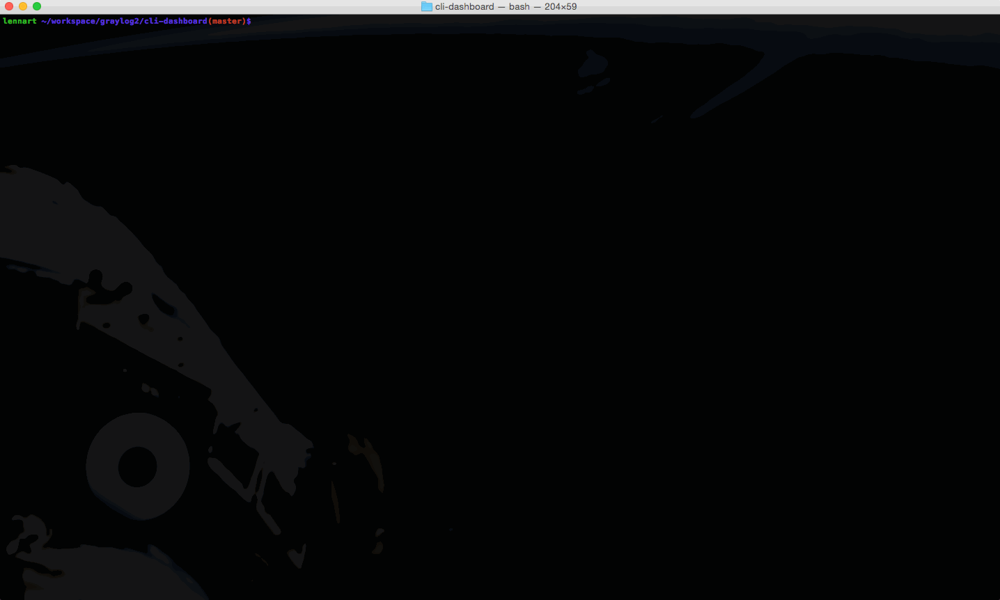

# The Graylog CLI dashboard

This is a [Graylog](http://www.graylog.org/) stream dashboard that runs in your shell. It is meant to be a perfect companion for example
when performing a release on the main monitor and having the dashboard on the second monitor to keep an eye on errors and exceptions on
your platform.

The most important library we use is [blessed-contrib](https://github.com/yaronn/blessed-contrib)
by [Yaron Naveh](https://twitter.com/YaronNaveh). Great job on that!

## Installation

Easy.

    $ npm install graylog-cli-dashboard -g
    $ graylog-dashboard -s [stream-id] -h [graylog-server REST API URL]

Full example:

    $ graylog-dashboard -s 549d7f9fbee84e568d181655 -h http://graylog.example.org:12900

#### If the graylog-dashboard executable cannot be found

You must have the `graylog-dashboard` executable that gets installed by NPM in your `PATH`. This is usually the case after installing
NPM in the first place but the output of `npm install` should show you where it was installed if you cannot find it:

    /usr/local/share/npm/bin/graylog-dashboard -> /usr/local/share/npm/lib/node_modules/graylog-cli-dashboard/graylog-dashboard.js
    # In this OSX example graylog-dashboard has been linked to the graylog-dashboard.js file in /usr/local/share/npm/...
    # Execute /usr/local/share/npm/bin/graylog-dashboard to try it out

## The dashboard in the wild.

Because this stuff looks like it is from space we suspect that people like to show it. Send us a photo of your dashboard running somewhere
and we are more than happy to publish it here. *Bonus points for messy desks or interesting stuff in the background.*

## Working with NPM

This is a few helpful notes for all of us who do not regularly work with the node/NPM ecosystem and can't remember how to do stuff.

#### Bumping and releasing a new version

    $ npm version [<newversion> | major | minor | patch]
    $ git push origin master && git push --tags
    $ npm publish